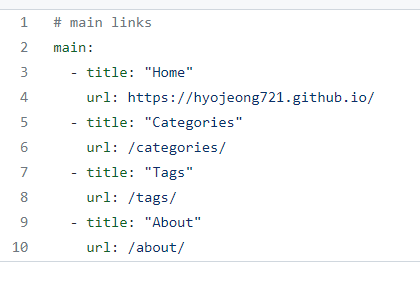

### ✅ _data -> navigation.yml 

---



- #### title

  - 상단 바에서 보이는 이름

- #### url

  - 두가지 방법

    - ##### 절대 경로 작성 : ex) https://hyojeong721.github.io/

    - ##### 상대 경로 작성 

      - 이 방법은 사전에 _pages 폴더를 만들어서 경로를 만들어줘야 함! 

      - ex) /cagegories/ : _pages -> category-archive.md 파일이 존재!

      - category-archive.md 안에 또 양식이 있음!

      - ```
        ---
        title: "Posts by Category" 
        layout: categories
        permalink: /categories/  
        author_profile: true
        ---
        ```

        

